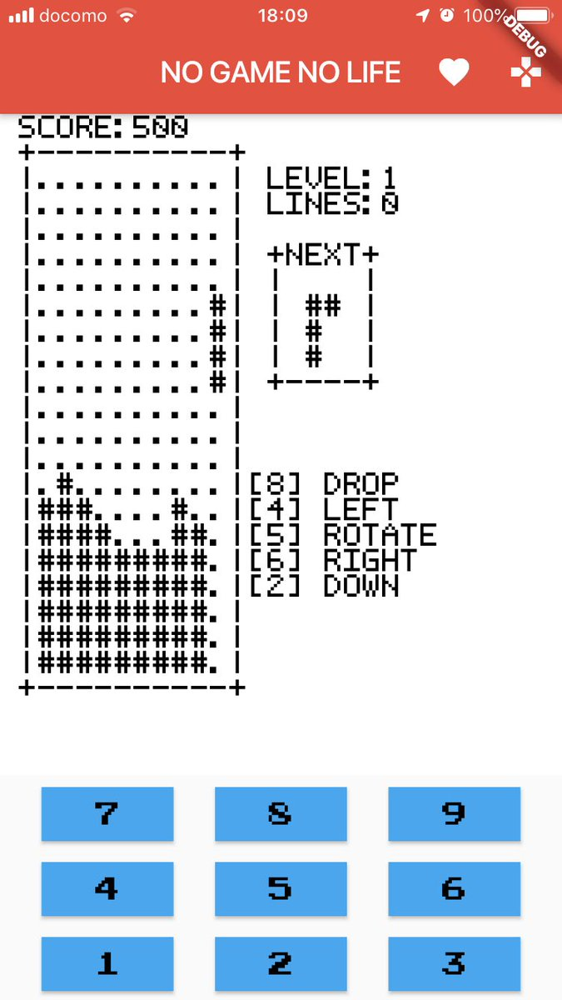

# NGNL(NO GAME NO LIFE)

NGNL is Flutter minimal game engine!!  
  
I tested two devices.  
Low resolution devices may have display problems.  
Sorry my works only in Portrait mode. It does not work in Landscape mode.  

- HUAWEI nova lite 2  
OS: Android OS 8.0  
Screen density:2160x1080  

- iPhone 7  
OS: iOS 12.0  
Screen density:1334x750  

I’m an old gamer.  
I learned programming on an 8bit computer to create the game.  
Flutter is very exciting. The 5KB code worked correctly on iOS and Android.  
I’m very grateful to the Flutter team. Thank you so much!  

## License
MIT

The MIT License

Copyright 2019 Takaaki Abe
Permission is hereby granted, free of charge, to any person obtaining a copy of this software and associated documentation files (the "Software"), to deal in the Software without restriction, including without limitation the rights to use, copy, modify, merge, publish, distribute, sublicense, and/or sell copies of the Software, and to permit persons to whom the Software is furnished to do so, subject to the following conditions:
The above copyright notice and this permission notice shall be included in all copies or substantial portions of the Software.
THE SOFTWARE IS PROVIDED "AS IS", WITHOUT WARRANTY OF ANY KIND, EXPRESS OR IMPLIED, INCLUDING BUT NOT LIMITED TO THE WARRANTIES OF MERCHANTABILITY, FITNESS FOR A PARTICULAR PURPOSE AND NONINFRINGEMENT. IN NO EVENT SHALL THE AUTHORS OR COPYRIGHT HOLDERS BE LIABLE FOR ANY CLAIM, DAMAGES OR OTHER LIABILITY, WHETHER IN AN ACTION OF CONTRACT, TORT OR OTHERWISE, ARISING FROM, OUT OF OR IN CONNECTION WITH THE SOFTWARE OR THE USE OR OTHER DEALINGS IN THE SOFTWARE.
